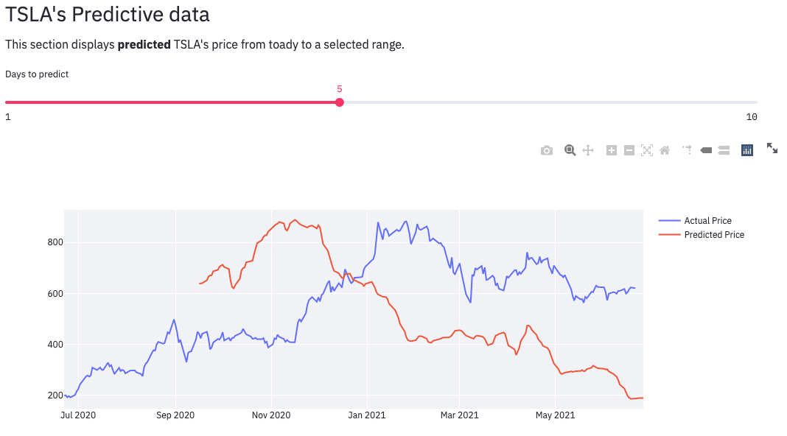

# Introduction: The Best Stock Visualizing and Predicting Site
Stock is trend for investment and financial management. People can make a great amount of earnings from it.
Simultaneously they can also loose a great amount of money from it. Wherefore, a great stock visualize tool
can boost trading efficiency. Moreover, it would be best if there's an add-on predicting tool to assist investors.
This post details how to build a stock visualizing and predicting site with twelvedata and streamlit.

## Contents
* How to Start (build process)
* Details of Approach
* Results
* References 

## How to Start (build process)
To create and activate a conda environment (Python 3.7.10):
```
conda create -n stock python==3.7.10
```

To check if your environment is successfully created:
```
conda env list
```

Activate conda environment:
```
conda activate stock
```

To install the project's dependencies:
```
pip install -r requirements.txt
```

After creating your environment, visit [twelvedata](https://twelvedata.com/) to obtain your API key:


To check if your API key is valid, run the example below.
```
from twelvedata import TDClient
# Initialize client - apikey parameter is requiered
td = TDClient(apikey="YOUR_API_KEY_HERE")

# Construct the necessary time serie
ts = td.time_series(
    symbol="TSLA",
    interval="1min",
    outputsize=10
)

# Returns pandas.DataFrame
print(ts.as_pandas())
```

You are all set to build The Best stock visualizing and predicting site. 

## Details of Approach
This project is divided into two parts, the workflow is display as below:


1. **Generating LSTM models**
   <p>In this part we generate LSTM for different stocks, by using tensorflow and keras.</p>
   <ul>
   <li>Obtain the data with twelvedata API</li>
   <li>Scale the data with MinMaxScaler with the range 0 to 1</li>
   <li>Re-organize the data, we choose to use 60 previous days of data to predict the 'close' price today</li>
   <li>Feed the data for training the LSTM model</li>
   <li>Finally, we output the model for later on usage</li>
   </ul>


2. **Build main site**
   <p>The main site is built with different sections of information, including historical data, predicted price etc.</p>

## Results
* The front page of the site

  
  
* In the left pane, users can choose **the stock** with a certain **time duration** they want to visualize and predict

  

* In the left column, we display **1 year of historical data**

  
  
* In the top right column, we display realtime data of selected stock. **Users can also select the time interval they like**

  
  
* In the bottom right column, the predicted stock price is displayed. **Users can choose the number of days of predictions they want to visualize**

  

## References
* API
  * [twelvedata](https://twelvedata.com/)
  * [twelvedata github](https://github.com/twelvedata/twelvedata-python/blob/master/README.md)
* Libraries:
  [Tensorflow](https://www.tensorflow.org/),
  [sklearn](https://scikit-learn.org/stable/),
  [streamlit](https://docs.streamlit.io/en/stable/),
  [plotly](https://plotly.com/python/graph-objects/)
* Data used：APPL historic stock data, AMZN historic stock data, TSLA historic stock data